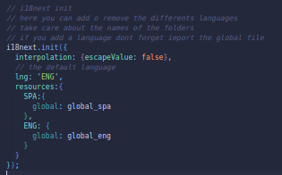
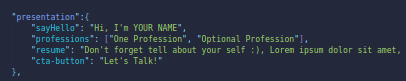
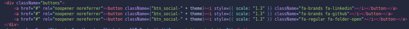
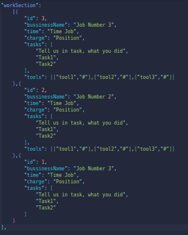
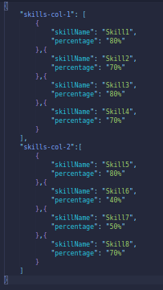
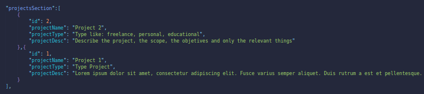
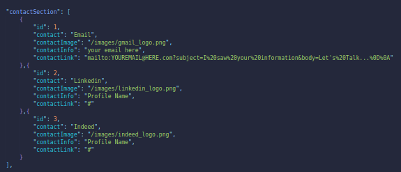

# Portfolio Web Template wiht React

This template is designed to be used according to your information and so that you can convey your professional information in the best possible way. The characteristics of this project are internationalization and change of theme (light/dark). Although modifying the project is simple, I recommend having basic knowledge of JavaScript and React.

In this Readme I will show you how you can modify this project to get the most out of it. I'll start by telling you that this project is divided into individual sections, this way you can modify each of the sections without worrying about affecting the behavior or content of the others. Now all the writing and part of the functionality of this web portfolio is in the translations folder. So, we'll start there.

## Internationalization

In each folder of translations or languages that you want within your portfolio you must create a JSON file called global that must have the same structure as the others. You will need to import it and add it to the i18next resources. To do this you must modify the main.jsx file.

I'll show you the structure of the global.json file so you can modify it to your liking.

## Presentation

First the presentation section, within this object you will only have to modify the content of the attributes, for example in sayHello you will only have to write a greeting or replace the default greeting. 

To replace the image, just choose the image of your choice and save it with the same name and the same extension. For links to social networks and links you must change the following section of the code. And for the icons just change the className with the Fontawasome icon you want.

## Work Section

For the work section, you must modify the information about the job, work time, tasks you performed, the position or position held and where you worked. Don't forget that if you add a position you must assign it a new id that should not be repeated. You can add the technological tools that you have used in your work along with their link. If you do not consider it relevant, you can eliminate it by deleting the tools attribute without any problem.

## Skill Section

For the skills section, this time you will have to go to `src\components\skillSection\skills.json` there you can modify the skills you want, I recommend using 80% maximum, as well as dividing your skills into two columns, for a better view.

## Projects Section

For the projects section, you will need the following information: project name, project type, and project description. Likewise, if you add a new project, don't forget to give it a unique id.

## Contact Section
The contact section can be much more customizable, you can add the platform or network through which you want to be contacted, as well as its image and link.

**If you want to modify the project much more, bring out your programming skills :D**

